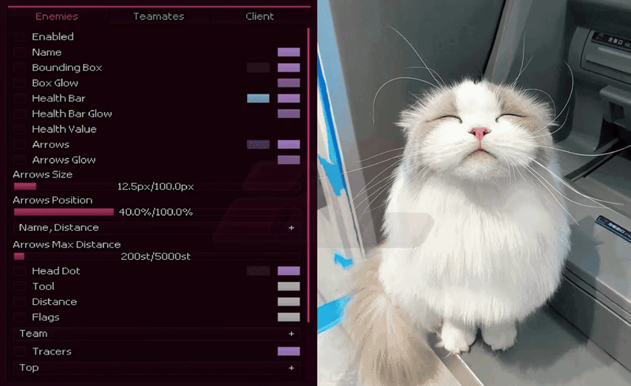

Hi I’m giks, I use  **BTW**.

I’m passionate about **Web Development** and **Operating Systems**. My favorite language for building **services** is , and I’m currently learning . At **UPC**, I’ve gained experience with various languages and frameworks such as , , , , , and . 

## Tech Stack

---

## GitHub Stats
  

